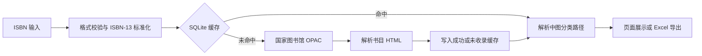

# 当前实现说明

本文记录项目当前已经落地的技术方案及后续边界。它以代码现状为准，不再作为尚未执行的初始开发计划。

## 数据流



## 模块职责

### `isbn_utils.py`

- 清理 ISBN 中的空格、连字符等非有效字符。
- 校验 ISBN-10 和 ISBN-13 校验位。
- 将有效 ISBN-10 转换成 ISBN-13。

### `nlc_query.py`

`NLCClient` 负责一次单条或批量任务中的国图通信：

- 使用稳定且精简的请求头。
- 禁止继承终端代理环境变量。
- 复用 `requests.Session`、连接池和国图动态会话 URL。
- 对连接错误、读取错误、429 和部分 5xx 响应最多重试 2 次。
- 使用退避策略并遵守 `Retry-After`。
- 验证动态地址必须属于 `opac.nlc.cn`，防止使用站外 URL。
- 兼容绝对地址、相对地址和端口变化。
- 查询页无法识别时刷新动态会话并额外尝试一次。
- 区分超时、连接失败、访问限制和响应结构异常。

`query_isbn()` 保留简洁的单条调用接口；批量任务向其传入共享的 `NLCClient`。

### `query_cache.py`

SQLite 表 `isbn_query_cache` 以标准 ISBN-13 为主键，保存：

- `success`：完整书目查询结果，默认有效期 90 天。
- `not_found`：国图未收录，默认有效期 24 小时。

每次操作独立建立短连接，并设置 5 秒忙等待，避免 Flask 请求之间长期共享 SQLite 连接。数据库路径可由 `ISBN_CLC_CACHE_PATH` 覆盖。

### `clc_parser.py`

保留原调用入口，实际实现位于 `clc_rules/`：

- `base.py` 只读加载原依赖库的45,785个类目，沿用其父链；不修改site-packages。
- `engine.py` 先保留原库精确匹配，再比较已审核规则的解析进度，最后返回明确的部分解析。
- `tables.json` 仅存复分数据，`rules.json` 定义作用域、来源、执行类型和样例。
- `inventory.json` 为全书机器候选，`review_map.json` 为人工核对关联，两者都不会在运行时自动转换为新规则。
- 主表已有的带符号专类优先，仿分只移植相对细目；国家、时代、民族上下文分别处理。
- 规则数据损坏时保留原库可用结果并提示；原库不可用时返回解析异常，但不重试国图。

首批规则已经接入，**全书规则审核与实现尚未完成**。覆盖数量和具体边界由[覆盖报告](docs/clc-rule-coverage.md)统一生成，不以候选数推算完成率。

### `app.py`

#### 单条查询

1. 校验并标准化 ISBN。
2. 通过独立 `NLCClient` 查询缓存或国图。
3. 调用 `parse_clc()` 解析分类路径。
4. 返回结构化 JSON。

#### 批量查询

1. 从 CSV、XLSX 或 TXT 提取 ISBN，最多 30 条；旧式二进制 XLS 需先转换为 XLSX。
2. 整个批次共享一个 `NLCClient`。
3. 使用标准 ISBN-13 作为批次内去重键。
4. 重复项复用首次结果，但保留每一条输入记录。
5. 仅真实网络请求后随机等待 2～4 秒。
6. 只根据真实上游请求更新连续失败计数。
7. 连续 3 次上游失败后打开本批次熔断器。
8. 使用 NDJSON 依次输出 `start`、`progress`、`wait` 和 `done` 事件。

#### 导出

前端把已完成的结果提交到 `/api/export`，后端使用 Pandas 和 Openpyxl 生成带时间戳的 Excel 文件。

单条、批量和导出共用 `clc_status` 等字段；分类路径不再冠以“完整”字样。未解析尾缀、号码状态和复分说明一并导出，所有书目/分类字符串以文字保存，避免 `=999` 等尾缀被Excel解释为公式。

## 错误类型

批量内部结果使用 `error_type` 区分主要失败原因：

| 类型 | 含义 |
|---|---|
| `validation` | ISBN 格式或校验位错误 |
| `not_found` | 国图未收录 |
| `upstream` | 国图超时、拒绝或连接失败 |
| `circuit_open` | 连续上游失败后暂停本批次后续网络查询 |
| `internal` | 未预期的内部错误 |

## 自动测试

测试使用 Python 标准库 `unittest`，不依赖真实国图网络：

```bash
python -m unittest discover -s tests -v
```

| 测试文件 | 覆盖内容 |
|---|---|
| `tests/test_query_cache.py` | 成功缓存、未收录缓存、TTL 过期 |
| `tests/test_nlc_query.py` | 动态 URL、会话复用、缓存命中、会话刷新 |
| `tests/test_app_batch.py` | 批量去重、结果行保留、连续失败熔断 |
| `tests/test_clc_parser.py` | 原库父链、复分样例、上下文隔离、停用号、未知部分与降级 |
| `tests/test_clc_api.py` | API兼容、批量状态、10行Excel读取、导出一致性与文字安全 |

测试不请求真实国图。`python -m tests.preview_clc` 可启动仅本机访问的独立页面验收服务（5051端口），显示的书目明确标记为测试数据，不改真实缓存。

## 运行时文件

以下内容不会提交到 Git：

- `.venv/`：本地 Python 虚拟环境。
- `data/`：SQLite 查询缓存。
- `uploads/`：Flask 运行时上传目录。
- `__pycache__/`：Python 字节码缓存。

## 复分规则阶段与未完成项

### 组合分类路径解析

- 已完成全书本机候选扫描、原库回归基线、补充引擎和首批I/K/S及通用复分规则。
- `I524.45` 与 `K835.635.72=43` 已能解释；`TP311.12` 等尚未支持的尾缀明确保留，不假装完整。
- `I12(198.4)`可补出古代希腊；古代地区的语义解释与编目适用性分开，完整解析也会保留适用限制提示。
- 还需对全书候选逐类去重、核对主表作用域、专用表、跨页援引、连续复分和组配规则。
- 世界地区/民族表仍有未录入条目；主表专类优先与停用历史也未全书审完。
- 低文本页、没有关键词的页与标记遗漏需独立检查；机器索引不能证明全书规则已收齐。
- 原始PDF、OCR片段、源文件指纹、本机路径和查询缓存不发布；公开候选索引只保留页码及规则定位元数据。

## 发布流程

项目采用功能分支和 Pull Request：

1. 在 `codex/` 前缀分支完成修改。
2. 运行自动测试和 `git diff --check`。
   暂存后运行 `python -m scripts.check_publication`，并人工核对文件列表及敏感内容。
3. 推送分支并创建面向 `main` 的 Pull Request。
4. 审核通过后合并，并同步本地 `main`。
